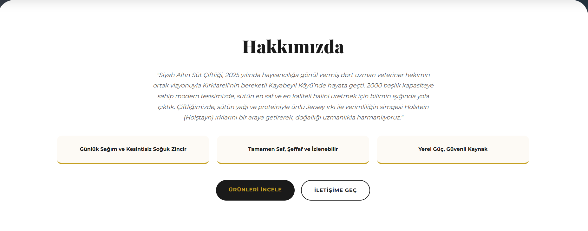
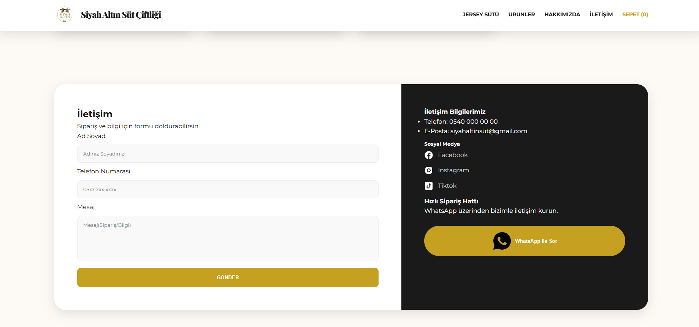
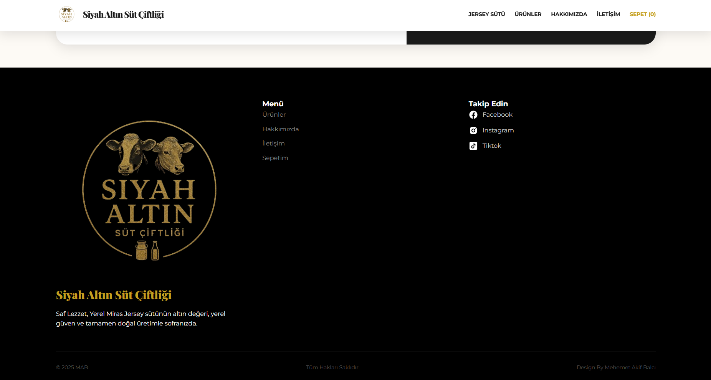

# 🥛 Siyah Altın Süt Çiftliği - Web Sitesi

Siyah Altın Süt Çiftliği, Kırklareli'nin bereketli topraklarında veteriner hekimlerin vizyonuyla hayata geçen, saf Jersey ve Holstein ırkı süt üretimini dijital dünyaya taşıyan modern, kullanıcı dostu ve premium tasarıma sahip bir e-ticaret / tanıtım web sitesidir.

---

## 📸 Ekran Görüntüleri

### 🖥️ Giriş (Hero) Alanı & Hakkımızda
<table>
  <tr>
    <td width="50%"><b>Ana Sayfa Karşılama Ekranı</b></td>
    <td width="50%"><b>Hakkımızda & Hikayemiz</b></td>
  </tr>
  <tr>
    <td></td>
    <td></td>
  </tr>
</table>

### 🛒 Ürünlerimiz & 📞 İletişim Formu
<table>
  <tr>
    <td width="50%"><b>Dinamik Ürün Keşif Alanı</b></td>
    <td width="50%"><b>İletişim & Hızlı Sipariş Hattı</b></td>
  </tr>
  <tr>
    <td></td>
    <td></td>
  </tr>
</table>

### 🖤 Alt Bilgi (Footer)
<p align="center">
  
</p>

---

## 🌟 Öne Çıkan Özellikler

* **Premium UI/UX Tasarımı:** Çiftliğin doğal ve elit ruhunu yansıtan, koyu tonlar (Siyah Altın) ve sıcak krem renkleri ile optimize edilmiş modern arayüz.
* **Dinamik Ürün Kartları:** Fiyatlandırma, ambalaj türü (5L Geleneksel lezzet vb.) ve sepet entegrasyonuna hazır mimari.
* **Hakkımızda & Kalite Kartları:** Markanın kuruluş hikayesini, veteriner hekim onaylı üretim sürecini ve soğuk zincir vurgusunu öne çıkaran dinamik bilgi blokları.
* **Fonksiyonel İletişim ve Sipariş Formu:** Kullanıcıların sipariş ve bilgi taleplerini doğrudan iletebilecekleri temiz giriş alanları.
* **Çok Kanallı Entegrasyon:** Sosyal medya butonları ve doğrudan siparişe yönlendiren entegre **WhatsApp Hızlı Sipariş Hattı**.
* **Tam Responsive & Scannable Düzen:** Kullanıcının gözünü yormayan, hiyerarşik font seçimleri ve dengeli boşluk (white-space) kullanımı.

---

## 🛠️ Kullanılan Teknolojiler

* **Front-End:** HTML5, CSS3 / Tailwind CSS (Arayüz bileşenleri ve modern grid/flex düzeni için)
* **Tasarım & Varlıklar:** Özel konsept ambalaj renderları, tipografi yerleşimleri ve vektörel logo entegrasyonu.

---

## 🚀 Kurulum ve Yerel Çalıştırma

### 1. Depoyu Klonlayın
```bash
git clone [https://github.com/makifblc/equipment_app.git](https://github.com/makifblc/equipment_app.git)
cd equipment_app
